Linux rcraid 9.x install guidance
============================

[中文](README.zh-hans.md)

Using Prebuilt Driver
----------------------

- 5.15.0-43 Linux Kernel :
    1. Download Linux Live ISO burn onto your USB.\
		(https://old-releases.ubuntu.com/releases/22.04.1/ubuntu-22.04.1-desktop-amd64.iso)
	2. Download 9.3.2 rcraid driver for 5.15.\
		([RAID_Linux_Ubuntu_2.2.40-9.3.2.00230.zip/Ubuntu\ 22.04.1/rcraid.ko](https://www.supermicro.com/wdl/driver/AMD/NVMe_RAID/RAID_Linux_Ubuntu_2.2.40-9.3.2.00230.zip))
	3. See the General Steps section.


- 6.14 Linux Kernel :
	1. download Linux Live ISO burn onto your USB.\
		(https://ubuntu.com/download/desktop/thank-you?version=25.04&architecture=amd64)
	2. download 9.3.2 rcraid driver for 6.14.\
		([x64.tar.zst/x64/rcraid.ko](linux/KERNEL6+/x64.tar.zst))
	3. See the General Steps section.

- General steps :
	1. Modify from `/casper/vmlinuz splash quiet ---` to `/casper/vmlinuz modprobe.blacklist=ahci,nvme break=mount ---` in `USB:/boot/grub/grub.cfg & loopback.cfg`
	2. Boot from USB. Click `Try and Install Ubuntu`
	3. Click `Try Ubuntu Live` then open `Terminal` (PreInstall)
		```bash
		mkdir -p /tmp/dd
		sudo mount -t vfat /dev/sdb1 /tmp/dd  # This `sdb1` is determined you downloaded path.
		sudo insmod /tmp/dd/rcraid.ko
		```
	4. Normal Install Ubuntu. ( Dont restart )
	5. Dont Update your kernel! ( dont run apt full-upgrade, if already updated, switch kernel manully in grub2 plz :) . )
	6. open `Terminal` (PostInstall)
		```bash
		sudo cp /tmp/dd/rcraid.ko /target/lib/modules/`uname -r`/kernel/drivers/scsi/rcraid.ko
		sudo chroot /target # switch chroot view in the following command.
		depmod -a `uname -r`
		mkinitramfs -o /boot/initrd.img-`uname -r` `uname -r`
		```
	7. `reboot`. All done!

Build Manually(Very Recommended)
----------------------

- 5.x - 6.14 Linux Kernel :
	1. Download Linux Live ISO burn onto your USB.
	2. Modify from `/casper/vmlinuz splash quiet ---` to `/casper/vmlinuz modprobe.blacklist=ahci,nvme break=mount ---` in `USB:/boot/grub/grub.cfg & loopback.cfg`.
	3. Boot from USB. Then open `Terminal`.\
		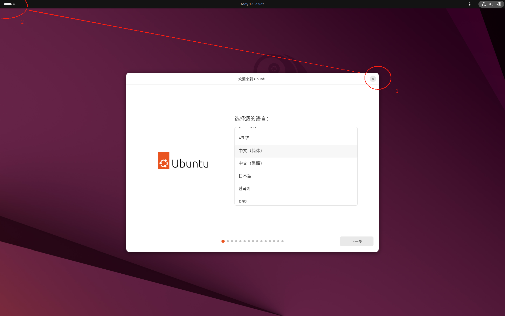
	4. PreInstall `git dwarves linux-header-xxx mokutil build-essential` in Package management for your linux distro.
		```bash
		git clone https://github.com/Bemly/raidxpert2-driver-installer.git
		git clone https://github.com/Bemly/rcraid-patch-932.git
		cd raidxpert2-driver-installer/driver_sdk/src
		patch -p2 < ../../rcraid-patch-932/rcraid-932.patch
		sudo make clean
		sudo make
		sudo insmod rcraid.ko
		```
		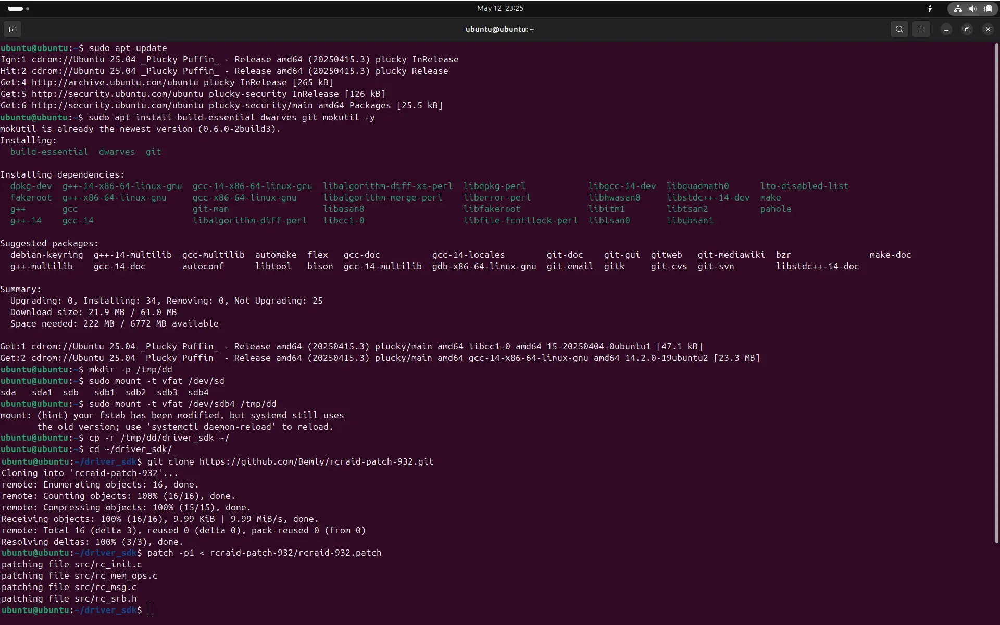
		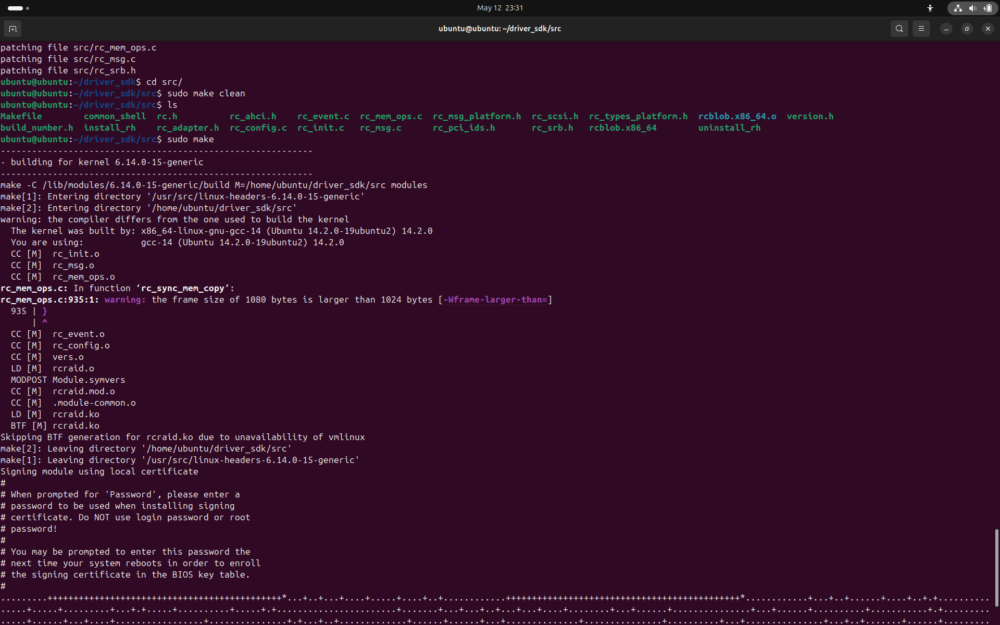
		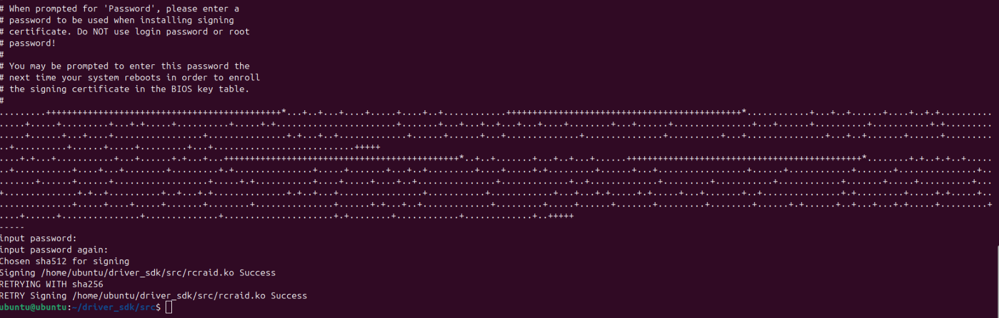
		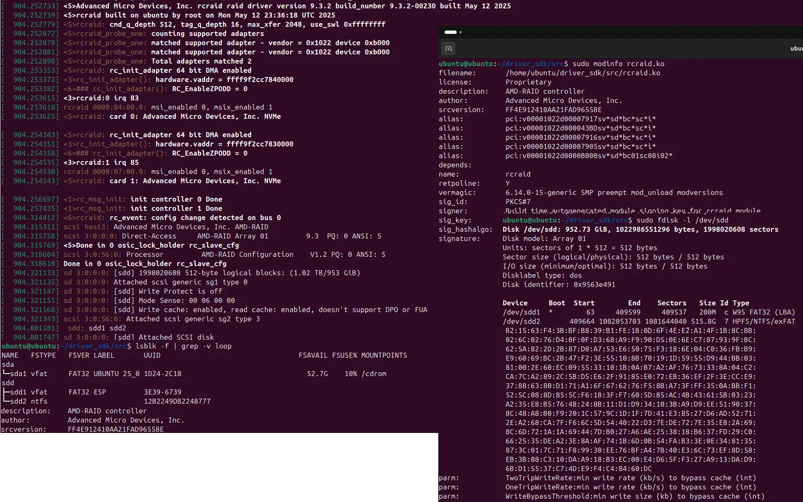
	5. Install your Linux distro into Raid Disk. (Dont Reboot)\
		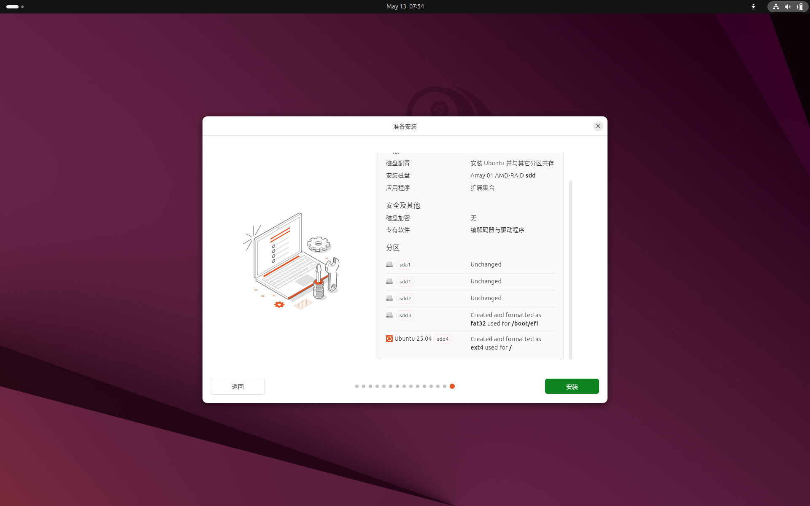
		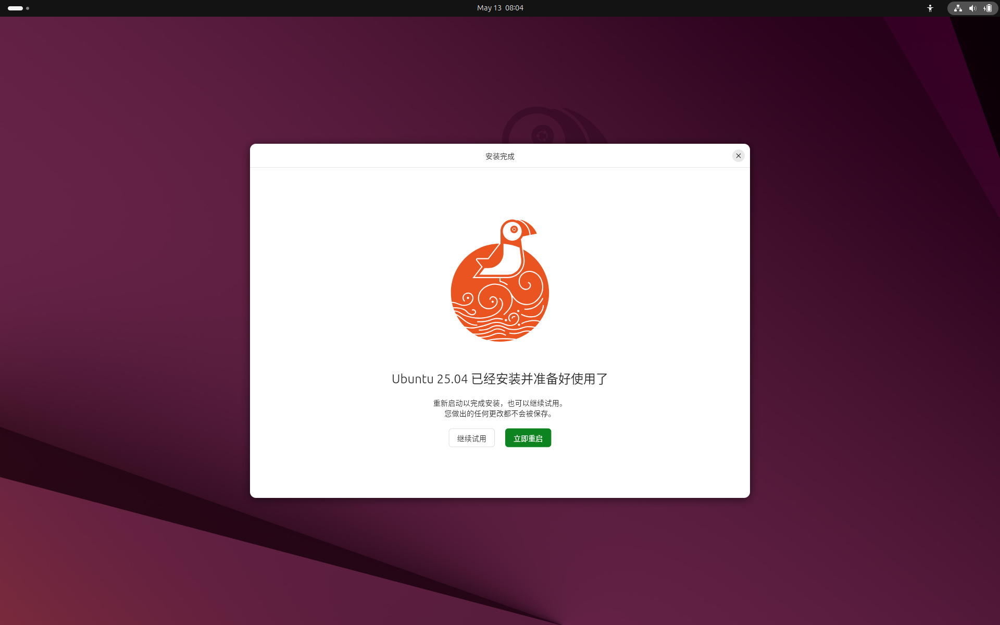
	6. PostInstall
		```bash
		sudo cp /tmp/dd/rcraid.ko /target/lib/modules/`uname -r`/kernel/drivers/scsi/rcraid.ko
		sudo chroot /target # switch chroot view in the following command.
		depmod -a `uname -r`
		mkinitramfs -o /boot/initrd.img-`uname -r` `uname -r`
		reboot
		```
		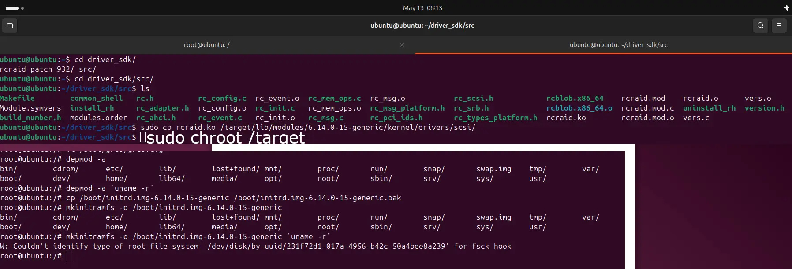
	7. The key may be registered when restarting. Select `Enroll Key` and enter the password just now to continue and it will take effect.\
		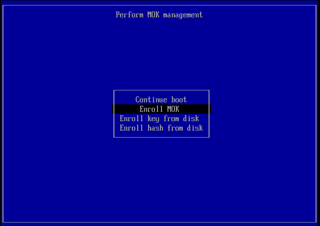
		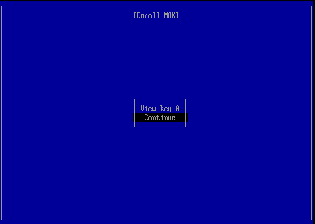
		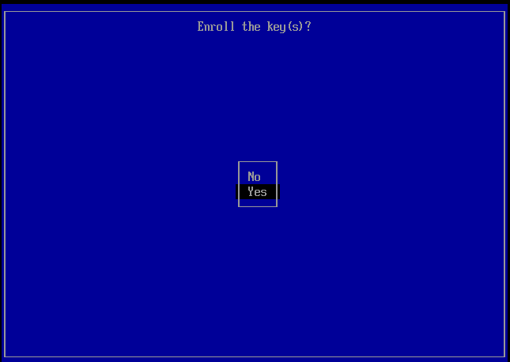
		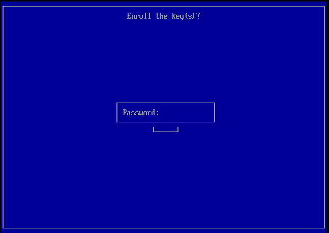
	8. All done!

Update Kernel
----------------------
```bash
git clone https://github.com/Bemly/raidxpert2-driver-installer.git
git clone https://github.com/Bemly/rcraid-patch-932.git
cd raidxpert2-driver-installer/driver_sdk/src
patch -p2 < ../../rcraid-patch-932/rcraid-932.patch
export KERVER=<new kernel verison>
sudo make clean
sudo make KDIR=/lib/modules/`$KERVER`/build/
sudo cp rcraid.ko /lib/modules/`$KERVER`/kernel/drivers/scsi/rcraid.ko
sudo depmod -a `$KERVER`
sudo cp /boot/initrd.img-`$KERVER` /boot/initrd.img-`$KERVER`.bak
sudo mkinitramfs -o /boot/initrd.img-`$KERVER` `$KERVER`
reboot
```

Appendix
----------------------
driver source: https://github.com/thopiekar/rcraid-dkms/pull/44#issuecomment-1013929676

My Laptop: ASUS TUF Gaming A16 Advantage Edition(FA617NS)
