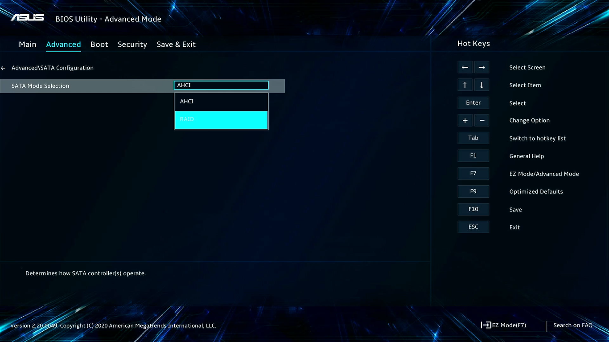
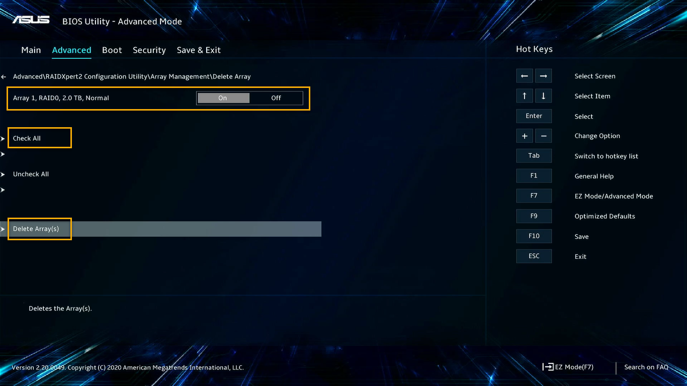
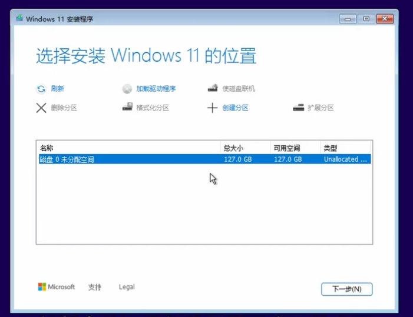
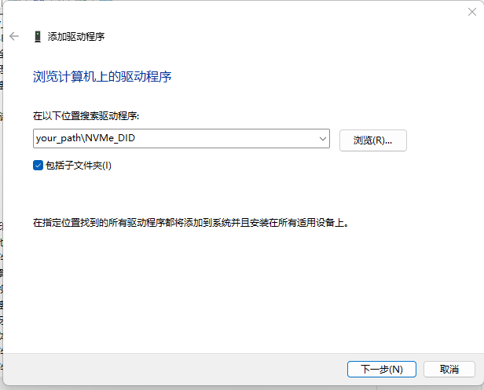
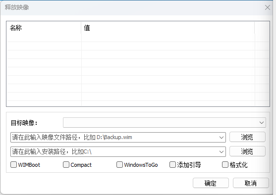
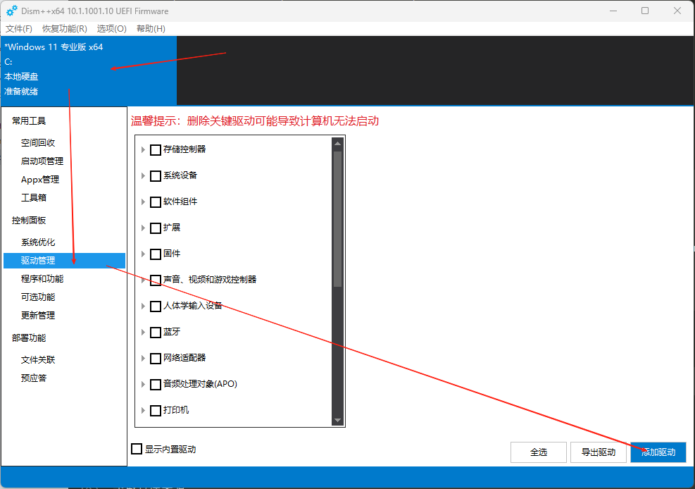
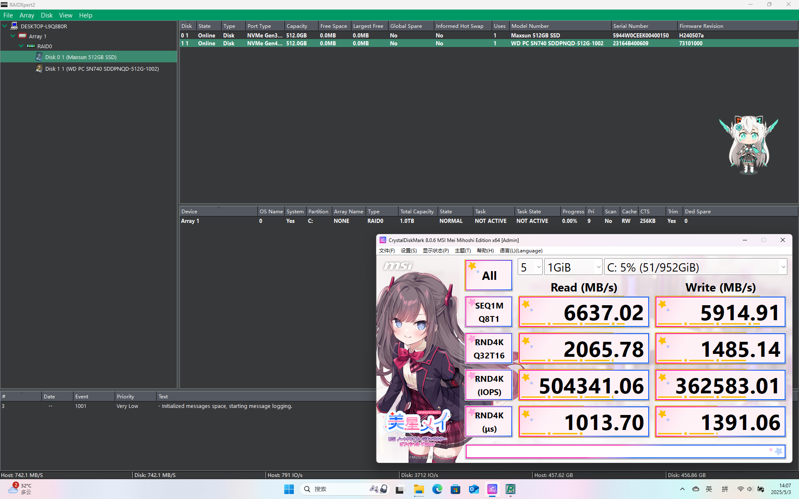
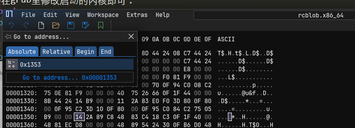

笔记本 fakeraid 驱动安装教程
=================================

引入
---------

官方写的脚本很糟糕，处于完全不能安装的地步，
包括但不限于无法访问谷歌导致超时、apt软件名错误导致不能安装等。

目前内核 5.x - 6.14 都能跑

为了避免嫌我啰嗦，我就把详细教程放在后面了，[一件直达](#手把手超详细双系统安装教程)（bushi


安装二进制驱动
---------

- 官方驱动包

先决条件: Ubuntu 22.04.1 

下载安装[官方驱动包](https://www.supermicro.com/wdl/driver/AMD/NVMe_RAID/RAID_Linux_Ubuntu_2.2.40-9.3.2.00230.zip)
或[备用下载](linux/UBUNTU22.04.1/x64.tar.zst)，根据里面附带的说明书执行即可。

> 预安装阶段:
> 启动安装镜像,在`Grub2`界面`Try and Install Ubuntu`选项上按`e`键进入编辑模式
> 在`/casper/vmlinuz`的`splash quiet ---`处修改为`modprobe.blacklist=ahci,nvme break=mount ---`
> 按下`F10`开始引导，正常情况进入`initramfs`阶段
> ```bash
> mkdir -p /tmp/dd
> mount -t vfat /dev/sxx /tmp/dd	# sxx是你驱动包路径(挂载分区格式以自己为准)
> /tmp/dd/preinstall
> ```
> 
> 安装 Ubuntu Installer(不要立即重启)
>
> 安装结束工作阶段:
> ```bash
> sudo su -	# (sudoers应该允许su) 或 sudo -i(sudoers应该允许bash)
> mkdir -p /tmp/ddp
> mount -t vfat /tmp/ddp
> /tmp/ddp/postinstall
> ```
> 重启完成！


- 新内核补丁驱动包

先决条件: 6.14内核版本的所有`Linux`发行版(如果你有空帮我把每个版本都编译一下)\
TODO: 拿 github action workflow 跑些通用的长期维护内核用

下载安装[驱动包](linux/KERNEL6+/x64.tar.zst)，
正常方式用`rufus`、`Balena Etcher`或`dd`烧录系统镜像到可移动介质，
烧录完成后在介质内路径`/boot/grub/`里修改`grub.cfg`和`loopback.cfg`，
其在每个`cfg`的`linux	/casper/vmlinuz`后追加`modprobe.blacklist=ahci,nvme`。

启动安装镜像，正常进入安装模式，在使用安装器分区之前，
打开`Terminal`终端挂载驱动包，运行里面自带的ko。
```bash
mkdir -p /tmp/dd
# 挂载装有驱动的文件夹(分区格式视具体情况而定)
sudo mount -t vfat /dev/sxx /tmp/dd
sudo insmod /tmp/dd/rcraid.ko
```

按理说此时注入成功将没有报错，即未发生`Kernel Panic`，
详细自行查看`sudo dmesg | tail -20` 或 `modinfo rcraid`。

正常安装系统到阵列中。

安装完毕之后打开`terminal`将ko驱动打入安装好的系统中：
```bash
# 如果之前没有卸载驱动文件夹的话，否则执行2、3条
sudo cp /tmp/dd/rcraid.ko /target/lib/modules/`uname -r`/kernel/drivers/scsi/rcraid.ko
# 挂载装有驱动的文件夹(分区格式视具体情况而定)
sudo mount -t vfat /dev/sxx /tmp/ddp
# 拷贝到内核模块里
sudo cp /tmp/ddp/rcraid.ko /target/lib/modules/`uname -r`/kernel/drivers/scsi/rcraid.ko
# 切换到目标系统的根环境
sudo chroot /target
```
进入系统`chroot`视图:
```bash
# 生成模块的依赖关系和映射文件
depmod -a `uname -r`
# 备份启动镜像 勇的话可以不用
cp -ap /boot/initrd.img-`uname -r` /boot/initrd.img-`uname -r`.bak
# 构建新的启动ramdisk内存文件系统
mkinitramfs -o /boot/initrd.img-`uname -r` `uname -r`
```


安装自编译驱动(推荐)
---------

先决条件: 5.x - 6.14内核版本的所有`Linux`发行版

正常方式用`rufus`、`Balena Etcher`或`dd`烧录系统镜像到可移动介质，
烧录完成后在介质内路径`/boot/grub/`里修改`grub.cfg`和`loopback.cfg`，
其在每个`cfg`的`linux	/casper/vmlinuz`后追加`modprobe.blacklist=ahci,nvme`。

进入`Live`系统，安装前先构建驱动：\
在你的发行版包管理里面下载所需的构建工具: `git dwarves linux-header-xxx mokutil build-essential`
> e.g. `apt install git dwarves linux-header-xxx mokutil build-essential | yes`
```bash
git clone https://github.com/Bemly/raidxpert2-driver-installer.git
git clone https://github.com/Bemly/rcraid-patch-932.git
cd raidxpert2-driver-installer/driver_sdk/src
patch -p2 < ../../rcraid-patch-932/rcraid-932.patch
sudo make clean
sudo make
sudo insmod rcraid.ko
```

按照平常的教程安装系统，装好之后记得不要关机，
还需要把驱动打入安装好的系统中：
```bash
sudo cp /tmp/dd/rcraid.ko /target/lib/modules/`uname -r`/kernel/drivers/scsi/rcraid.ko
sudo chroot /target # 进入到chroot视图执行下面两条命令
depmod -a `uname -r`
mkinitramfs -o /boot/initrd.img-`uname -r` `uname -r`
exit
reboot
```
安装完成，重启进入系统即可。


更新内核
---------

更新内核完之后注意不要立即重启，
因为有可能驱动和新版本内核ABI变动较大导致不能加载导致内核恐慌

一般`Arch`是滚动内核发行版，注意运行完包管理`pacman yay paru`
之后时刻查看下内核是否改变。
一般`Ubuntu`是长期维护的稳定内核发行版，一般`apt update && apt full-upgrade`
之后才会更新内核。

更新完内核之后需要重新编译内核驱动文件：
```bash
git clone https://github.com/Bemly/raidxpert2-driver-installer.git
git clone https://github.com/Bemly/rcraid-patch-932.git
cd raidxpert2-driver-installer/driver_sdk/src
patch -p2 < ../../rcraid-patch-932/rcraid-932.patch
export KERVER=<new kernel verison>
sudo make clean
sudo make KDIR=/lib/modules/`$KERVER`/build/
sudo cp rcraid.ko /lib/modules/`$KERVER`/kernel/drivers/scsi/rcraid.ko
sudo depmod -a `$KERVER`
sudo cp /boot/initrd.img-`$KERVER` /boot/initrd.img-`$KERVER`.bak
sudo mkinitramfs -o /boot/initrd.img-`$KERVER` `$KERVER`
reboot
```
然后就可以愉快启动新内核的系统了，目前支持的内核是`6.14`
新内核如果报错请自行`patch`,(如果有`patch`好的欢迎`PR`,thk www)

报错参见[报错解决方案](#报错解决方案)


手把手超详细双系统安装教程
---------

某天没事做翻`bios`发现自己笔记本除了`AHCI`的模式，还支持`RAID`模式嘞，
奔着想要搞个`raid0`来提提速的想法，索性就来试一试这个传说中的笔记本`raid`模式。[^1]

<!-- source: https://kmpic.asus.com/images/2021/09/30/f1c03f6d-af06-4366-bb94-685e98528901.png -->


根据`arch`教派的亲传[^2]，
这玩意可以通过`dmraid`来安装驱动来识别`raid`组，
不过这个貌似只支持牢英的`Intel Rapid Storage Technology`，
而且也被废弃了，目前牢英官方推荐使用`mdadm`进行软raid抽象层管理，
`dmraid`是通过`/dev/mapper`来管理设备的，而不是`/dev/sdx`，
下面不再使用`dmraid`安装，采用`AMD`官方的`rcraid`驱动管理。

### BIOS 配置

一般`DIY`主板用户在对应平台下载`raid驱动包`即可，
我是`天选4R`(AMD A+A YES)，故就在对应官网笔记本驱动下载。
详细过程非常简单，官方有一系列的操作图示，跟着就行。[^3]

> 1. 进入 BIOS 设定: 计算机重新启动时,在 POST\(开机自动测试\) 时按下 `F2`，进入BIOS 设定页面。
> 2. 当进入 BIOS 设定画面时, 将会出现计算机系统信息。之后在页面中按下 `F7` 进入 \[Advanced Mode\] \(进阶模式\)。
> 3. 在 \[Advanced Mode\] 设定页面中，选择 \[SATA Configuration\] 按下 `Enter` 进入。
> 4. 在 \[SATA Configuration\] 页面中，将 \[SATA Mode Selection\] 项目切换为 \[RAID\]，之后按下 `F10` 储存并离开BIOS设定，即完成开启 \[RAIDXpert2 Configuration Utility\]。
> 5. 重复1-2步骤进入BIOS 设定页面，选择 \[RAIDXpert2 Configuration Utility\] 按下 `Enter` 进入。
> 6. 在 \[RAIDXpert2 Configuration Utility\] 页面中，选择 \[Array Management\] 然后按下 `Enter`。
> 7. 在 \[Array Management\] 页面中，选择 \[Delete Array\] 项目后按下 `Enter`。
> 8. 在 \[Delete Array\] 页面中，将选定的RAID 数组切换至 \[On\] 或全选为 \[Check All\]，之后选择 \[Delete Array\(s\)\] 项目按下 `Enter`。
> 9. 最后在 \[Warning\] 页面中再次确认，完成后切换 \[Confirm\] 项目至 \[On\]，之后选择 \[Yes\] 开始执行删除。

<!-- source: https://kmpic.asus.com/images/2021/09/30/cba55582-2e90-4612-b653-f2b39726e3e6.png -->
 

在创建完`raid`阵列后，此处应该会出现阵列控制器的类型标识，
我这里的天选笔记本是`NVME DID`，
先记着，后面需要用到。


### 双系统 安装(Win侧)

#### 方案一：直接使用烧录的 Windows 安装镜像

使用镜像烧录到`优盘`或者`光盘`等`可移动媒介`触发微软官方的安装引导即可，
烧录之后还需要下载`rcraid`驱动，驱动在对应平台官网下载，
`rcraid`驱动大部分是通用的（
[官方下载](https://www.supermicro.com/wdl/driver/AMD/NVMe_RAID/RAID_Windows_Driver_932_00187.zip)或[备份下载](windows/WIN11/x64.tar.zst)
），下载之后解压放在`可移动媒介`上的任意位置。

> 注意: 备份下载源用的`tar(POSIX ustar)`打包，`Zstandard`压缩算法，
>		可能需要自行下载解压工具！

> 注意: 一般使用9.x版本的`rcraid`驱动，8.x版本的驱动只支持`SATA`。
> 		[官方手册](pdf/53987-3.12.pdf#page=25)第25页已列出详细说明[^4]
> 
> See the system’s motherboard specifications for the supported device interface. RC-
> 8.1 and RC-8.2 branches support only SATA. RC-9.1 and above release branches
> support SATA, M.2 NVMe SSD and HHHL NVMe SSD


在`选择安装Windows的位置`界面正常应该显示多个无法识别的`Linux Swap`分区，
此处选择`加载驱动程序`加载刚刚下载解压后的驱动文件夹，
根据自己`阵列类型`选择对应驱动。



`阵列类型`在[官方手册](pdf/53987-3.12.pdf#page=55)第55页有详细说明。
在上方教程`bios 配置`中可以看到自己`阵列类型`。[^4]

一般来说SATA接口都是`RAID_SATA`, M.2 key E接口是`NVMe_DID`或`NVMe_CC`，
`CC`是老设备兼容,`DID`是新M2驱动格式，
一般3000系带集显的桌面端锐龙处理器、二代以上线程撕裂者处理器、移动设备处理器选`DID`，
其余`NVMe`都是`CC`。

选择之前下载解压后的驱动，没问题的话应该是导入成功三个驱动(`rcbottom,rccfg,rcraid`)。



> 注意: 不要把`DID CC SATA`都导入了，只能导入其中一个。

导入正常后返回`选择安装Windows的位置`界面，
按照正常方式选择阵列磁盘安装系统即可。

进入安装好的系统做完`OOBE`即可完成。

#### 方案二：使用 WinPE 10+ DISM/Ghost 安装

先决条件: 一个可以使用的Windows PE或者RE，注意需要Windows NT 10以上的内核。

下载`rcraid`驱动，驱动在对应平台官网下载，
`rcraid`驱动大部分是通用的（
[官方下载](https://www.supermicro.com/wdl/driver/AMD/NVMe_RAID/RAID_Windows_Driver_932_00187.zip)或[备份下载](windows/WIN11/x64.tar.zst)
），下载之后解压放在PE/RE能够访问的任意位置。

> 注意: 备份下载源用的`tar(POSIX ustar)`打包，`Zstandard`压缩算法，
>		可能需要自行下载解压工具！

> 注意: 一般使用9.x版本的`rcraid`驱动，8.x版本的驱动只支持`SATA`。
> 		[官方手册](pdf/53987-3.12.pdf#page=25)第25页已列出详细说明[^4]
> 
> See the system’s motherboard specifications for the supported device interface. RC-
> 8.1 and RC-8.2 branches support only SATA. RC-9.1 and above release branches
> support SATA, M.2 NVMe SSD and HHHL NVMe SSD

进入`PE`后，`Win+X`选择`设备管理器`进入，点击`添加驱动程序`。


`阵列类型`在[官方手册](pdf/53987-3.12.pdf#page=55)第55页有详细说明。
在上方教程`bios 配置`中可以看到自己`阵列类型`[^4]

一般来说SATA接口都是`RAID_SATA`, M.2 key E接口是`NVMe_DID`或`NVMe_CC`，
`CC`是老设备兼容,`DID`是新M2驱动格式，
一般3000系带集显的桌面端锐龙处理器、二代以上线程撕裂者处理器、移动设备处理器选`DID`，
其余`NVMe`都是`CC`。

选择之前下载解压后的驱动，没问题的话应该是导入成功三个驱动(`rcbottom,rccfg,rcraid`)。


> 注意: 不要把`DID CC SATA`都导入了，只能导入其中一个。

导入成功后，选择对应阵列磁盘，按照正常方式安装即可，
`dism`、`ghost`安装方法都没任何问题。
安装完毕之后还需要给安装的系统打上`rcraid`驱动。

使用`ghost`（已废弃）：

- `.gho`恢复镜像前后自行选择`dism`安装驱动。

使用`dism`（不推荐）：

- 给`wim/esd/vhd/vhdx/vfd`等未安装的镜像打入驱动,
此处的路径需要根据你的需要自行修改
```powershell
# 确定镜像文件和索引号(wim可改为esd/vhd/vhx/vfd等等,后面同理)
Dism /Get-ImageInfo /ImageFile:"C:\path\to\install.wim"
# 挂载空挂载点
mkdir D:\mount
# 挂载 Windows 镜像
Dism /Mount-Image /ImageFile:"C:\path\to\install.wim" /Index:你的索引号 /MountDir:"D:\mount"
# 添加驱动程序到挂载的镜像(dism自动搜索)
Dism /Image:"D:\mount" /Add-Driver /Driver:"C:\path\to\your\driver\folder" /Recurse
# 卸载镜像并保存更改
Dism /Unmount-Image /MountDir:"D:\mount" /Commit
```

- 给安装完毕的系统打入驱动
```powershell
# 选择系统盘打入驱动
Dism /Image:"D:\" /Add-Driver /Driver:"C:\path\to\your\driver\folder" /Recurse
```

使用图形化`dism++`（推荐）：

- 释放镜像安装系统



选择`安装的系统`>选择`驱动管理`>选择`添加驱动`\
选择之前下载解压后的驱动，没问题的话应该是导入成功三个驱动(`rcbottom,rccfg,rcraid`)\


进入安装好的系统做完`OOBE`即可完成。


### 双系统 安装(Linux侧)

参照上方[教程](#安装自编译驱动推荐)即可。

进入到安装界面，点击关闭按钮，打开终端\


`patch`驱动兼容代码\


编译内核驱动\


`mokutil`负责签名驱动，此处输入一个密码，请记住此密码\


编译完成后`sudo insmod rcraid.ko`，如果没有`Kernel Panic`说明安装成功

可以用`modinfo`、`dmesg`检查一下是否加载成功\


如果成功的话就可以正常安装`Linux`了\


装好之后不要急着重启，现在安装的系统还没打入`rcraid`驱动，
现在放到`/lib`里面然后`modprobe`、`depmod`生成依赖映射关系文件`modules.dep`，
备份下`initrd.img`内存启动镜像，然后`mkinitramfs`构建新的内存启动镜像\


重启时可能会注册密钥，选择`Enroll Key`输入刚才的密码继续即可生效\


然后就大功告成辣~ `<3`

### 安装管理器

#### Windows侧

使用 `Microsoft Store` 或者 `winget` 下载。[^5]

```powershell
winget install -e --id 9nd45c02n872
```

也可使用 `第三方安装包` 侧载。[^6]

进入[`store.rg-adguard.net`](https://store.rg-adguard.net/)或[`备用下载`](windows/manager/UWP_Certified.tar.zst)，
选择`ProductID`，输入`9nd45c02n872`，选择`RP`，确定。
先下载安装对应架构的`VCLibs`依赖包，再下载安装本体。



#### Linux侧

TODO


报错解决方案
---------

报错之后建议回滚内核，一般不用删掉新内核，
直接在grub里修改启动的内核即可：
```bash
sudo vi /etc/default/grub
... # 此处省略，找到对应的启动项，修改为原内核
# 更新grub2 每个发行版不一致 根据实际情况调整
sudo update-grub
sudo grub2-mkconfig -o /boot/grub2/grub.cfg
sudo grub-mkconfig -o /boot/grub/grub.cfg
```

如果`编译成功`/`insmod/modprobe成功`却没有识别到阵列，
```bash
sudo dmesg | grep -i "license level"
```
如果无输出则玄学问题，暂时无解。


如果有输出说明是许可证问题，使用下面的魔法方法解决：

下载`imhex`等16进制编辑器,编辑`rcblob.x84_64`文件，
跳转到`1353`地址，修改`14`为`11`即可。
（仅供个人使用参考,不负任何责任)



然后继续重新按照上述操作`make`编译项目即可，
按理说即可如下图所示识别出对应阵列信息。


```plaintext
下载仓库来源
linux
 ├─KERNEL6+: manully patch
 ├─manager: https://www.supermicro.com/wdl/driver/AMD/NVMe_RAID/RAIDXpert2_Linux_932_00230.zip
 └─UBUNTU22.04.1: https://www.supermicro.com/wdl/driver/AMD/NVMe_RAID/RAID_Linux_Ubuntu_2.2.40-9.3.2.00230.zip
windows
 ├─manager: https://www.supermicro.com/wdl/driver/AMD/NVMe_RAID/RAIDXpert2_Windows_932_00195.zip
 ├─ROG: https://dlcdnet.asus.com/pub/ASUS/GamingNB/DriverforWin10/Raid_ROG/Raid_windows_driver_930_00266.zip
 ├─WIN10: https://www.supermicro.com/wdl/driver/AMD/NVMe_RAID/Raid_PKG_S0i3_win_9.3.2_00158.zip
 └─WIN11: https://www.supermicro.com/wdl/driver/AMD/NVMe_RAID/RAID_Windows_Driver_932_00187.zip
```

[^1]: 幻16逆天跑分：https://www.bilibili.com/video/BV17W4y1h7mT
[^2]: fakeraid介绍：https://wiki.archlinuxcn.org/wiki/RAID#实现方式
[^3]: 华硕笔记本raid教程：https://www.asus.com.cn/support/faq/1046579/#cc
[^4]: 官方文档53987 3.12修订版: https://drivers.amd.com/relnotes/amd-raidxpert2_user_guide_3.12.pdf
[^5]: AMD RAIDXpert2 windows官网下载地址: https://apps.microsoft.com/detail/9nd45c02n872
[^6]: AMD RAIDXpert2 windows厂商下载地址: https://www.supermicro.com/wdl/driver/AMD/NVMe_RAID/RAIDXpert2_Windows_932_00195.zip
